# Módulo 1 — Preparar el PC

- Estado: Completado
- Fecha: 2026-10-05
- Host: Ubuntu 24.04.5 LTS (Noble), kernel 7.0.0-34-generic, x86_64
- Objetivo: tener un host Ubuntu con todas las herramientas para compilar un kernel ARM64 de forma cruzada, y conocer sus límites (RAM, disco, versión de Clang) antes de tocar el kernel del Redmi Note 11.

## Concepto

El teléfono es **ARM64** y este PC es **x86_64**, así que el kernel se compila de forma cruzada: el compilador corre en x86_64 y genera código para ARM64. Antes de bajar el código fuente hay que comprobar que están el compilador (`clang`), el linker (`ld.lld`), las utilidades LLVM, un GCC cruzado de respaldo para ARM64 y uno de 32 bits para el vDSO que Android exige, además de `dtc` para los Device Tree.

**Regla del módulo:** primero se comprueba qué hay (solo lectura), después se instala solo lo que falta. Si una herramienta de la distro falla, se usa la fuente oficial (AOSP).

## Práctica guiada

```bash
# Paso 1: diagnóstico del entorno (solo lectura)
cat /etc/os-release
uname -m
lscpu | grep -E "Model name|^CPU\(s\)"
free -h
df -h "$HOME"
git --version
make --version | head -1
gcc --version | head -1
clang --version | head -1
ld.lld --version
adb version
fastboot --version

# Paso 2: instalar lo que faltaba (modifica el sistema)
sudo apt update
sudo apt install -y lld llvm bc bison flex libssl-dev libelf-dev libncurses-dev \
  dwarves cpio rsync ccache device-tree-compiler \
  gcc-aarch64-linux-gnu gcc-arm-linux-gnueabi

# Verificación
ld.lld --version
llvm-ar --version | head -2
aarch64-linux-gnu-gcc --version | head -1
arm-linux-gnueabi-gcc --version | head -1
dtc --version

# Paso 3: mkbootimg y acceso USB (solo lectura)
which mkbootimg unpack_bootimg
apt-cache policy mkbootimg android-sdk-platform-tools-common | grep -E "^[a-z]|Instalados|Candidato"
id -nG
ls /etc/udev/rules.d/ /usr/lib/udev/rules.d/ | grep -i -E "android|adb|51"

# Paso 4: instalar mkbootimg de Ubuntu (resultó roto, ver hallazgo #8)
sudo apt install -y mkbootimg
dpkg -L mkbootimg | grep -E "bin/|\.py"
mkbootimg --help | head -5          # ModuleNotFoundError: No module named 'gki'

# Paso 5: usar el código oficial de AOSP (misma versión que adb)
mkdir -p tools
git clone --depth=1 --branch platform-tools-34.0.4 \
  https://android.googlesource.com/platform/system/tools/mkbootimg tools/mkbootimg
python3 tools/mkbootimg/mkbootimg.py --help | head -5
python3 tools/mkbootimg/unpack_bootimg.py --help | head -3

# Paso 6 y 7: registro de versiones (salida cruda en logs/01-versiones.txt)
{ echo "== Fecha: $(date -I)"; lsb_release -ds; uname -mr; git --version; make --version | head -1; gcc --version | head -1; clang --version | head -1; ld.lld --version; llvm-ar --version | head -2 | tail -1; aarch64-linux-gnu-gcc --version | head -1; arm-linux-gnueabi-gcc --version | head -1; dtc --version; adb version | head -1; fastboot --version | head -1; python3 --version; echo "mkbootimg AOSP: platform-tools-34.0.4 ($(git -C tools/mkbootimg rev-parse --short HEAD))"; } | tee logs/01-versiones.txt
sed -i "s|^  Optimized build\.|$(llvm-ar --version | head -1)|" logs/01-versiones.txt   # corrección, ver hallazgo #11
```

## Hallazgos reales

1. **Faltaba una sola herramienta: `ld.lld`.** Git 2.43, Make 4.3, GCC 13.3, Clang 18.1.3, ADB y Fastboot 34.0.4 ya estaban instalados. `ld.lld` daba `command not found`; después de instalar el paquete `lld` responde `Ubuntu LLD 18.1.3`.
2. **Clang 18 es probablemente demasiado nuevo para el kernel 4.19 de Android.** Se anota ahora como riesgo y se confirmará en el Módulo 5: si la compilación falla por culpa del compilador, hará falta un Clang de la era Android 11 en `tools/` (no se instala con `apt`).
3. **La RAM manda el paralelismo.** El PC tiene 12 hilos pero solo 14 GiB de RAM (≈7,7 GiB disponibles con el sistema en uso). Para compilar se usará `make -j8` en lugar de `-j12` para no agotar la memoria.
4. **El disco es el recurso más justo:** 87 GB libres (81 % usado). El kernel, la ROM de fábrica y las compilaciones ocupan unos 30 GB; hay que vigilarlo.
5. **`lscpu | grep "Model name"` no devolvió el modelo** porque el sistema está en español y la etiqueta es "Nombre del modelo". Es un detalle de idioma, no un fallo.
6. **`apt` ofreció eliminar paquetes antiguos** (`linux-image-7.0.0-31-generic` y relacionados, "ya no son necesarios"). No se tocaron: no son parte de este módulo, pero liberarían espacio de disco si hiciera falta más adelante (`sudo apt autoremove`, revisando antes la lista).
7. **La instalación de las dependencias fue limpia:** `bc`, `libssl-dev`, `libncurses-dev`, `cpio` y `rsync` ya estaban en su versión más reciente; el resto se instaló sin errores.
8. **El paquete `mkbootimg` de Ubuntu 24.04 está roto.** Se instala (`1:34.0.4-1build3`), pero `mkbootimg --help` falla con `ModuleNotFoundError: No module named 'gki'`: el script importa `gki.generate_gki_certificate` y el paquete no incluye esa carpeta (solo trae `mkbootimg`, `unpack_bootimg` y la documentación). Es un defecto del empaquetado, no del equipo. `unpack_bootimg` de Ubuntu sí funciona.
9. **Solución: código oficial de AOSP, fijado a una etiqueta.** Se clonó `platform-tools-34.0.4` (commit `71b8e43`), la misma versión que `adb` y `fastboot`, a `tools/mkbootimg/` (ignorada por Git). Incluye la carpeta `gki`, `mkbootimg.py`, `unpack_bootimg.py` y `repack_bootimg.py`. A partir de aquí se usan siempre `python3 tools/mkbootimg/mkbootimg.py` y `unpack_bootimg.py`, no los de `/usr/bin`.
10. **El acceso USB ya estaba listo.** El usuario pertenece a `plugdev` y existe `51-android.rules` (paquete `android-sdk-platform-tools-common`), así que `adb` verá el teléfono sin `sudo` cuando lo conectemos en el Módulo 2.
11. **Un comando terminó sin error pero guardó un dato equivocado.** En el registro de versiones, `llvm-ar --version | head -2 | tail -1` tomó la segunda línea (`Optimized build.`) en lugar de la primera (la versión). Se detectó al revisar el archivo y se corrigió con `sed -i`. Lección: comprobar el contenido de lo guardado, no solo que el comando no dé error.

## Versiones registradas

| Herramienta | Versión |
|---|---|
| Ubuntu | 24.04.5 LTS |
| Git | 2.43.0 |
| GNU Make | 4.3 |
| GCC | 13.3.0 |
| Clang / LLD / LLVM | 18.1.3 |
| `aarch64-linux-gnu-gcc` | 13.3.0 |
| `arm-linux-gnueabi-gcc` | 13.3.0 |
| DTC | 1.7.0 |
| ADB / Fastboot | 34.0.4 |
| Python | 3.12.3 |
| mkbootimg (AOSP) | `platform-tools-34.0.4` (71b8e43) |

Salida cruda completa en `logs/01-versiones.txt`.

## Evidencias

**01 — Sistema, CPU, RAM y disco (hallazgos #3 y #4)**
`/etc/os-release`, `uname -m` (x86_64), `lscpu` (12 hilos), `free -h` (14 GiB) y `df -h` (87 GB libres, 81 % usado).
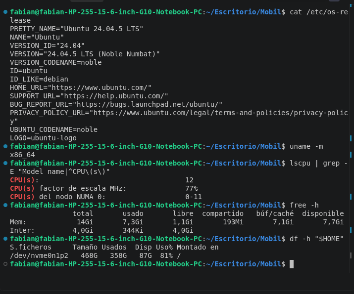

**02 — Herramientas de compilación y falta de `ld.lld` (hallazgos #1 y #2)**
Versiones de Git, Make, GCC y Clang 18.1.3; `ld.lld` responde `No se ha encontrado la orden`.
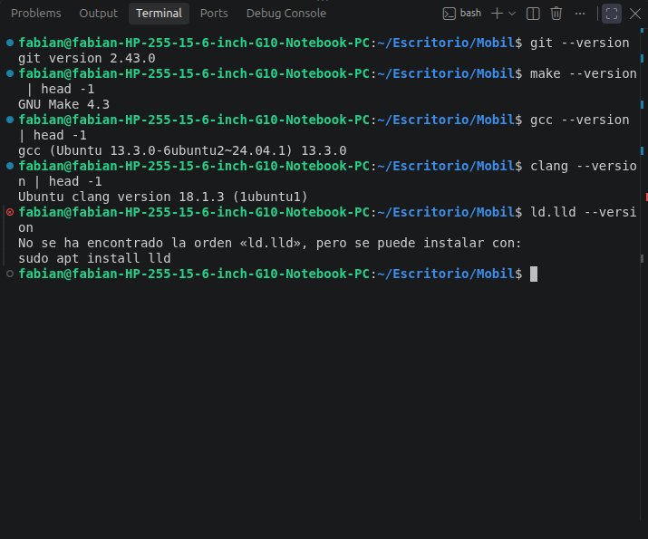

**03 — ADB y Fastboot**
`adb version` y `fastboot --version`: ambos en 34.0.4, instalados en `/usr/lib/android-sdk/platform-tools/`.
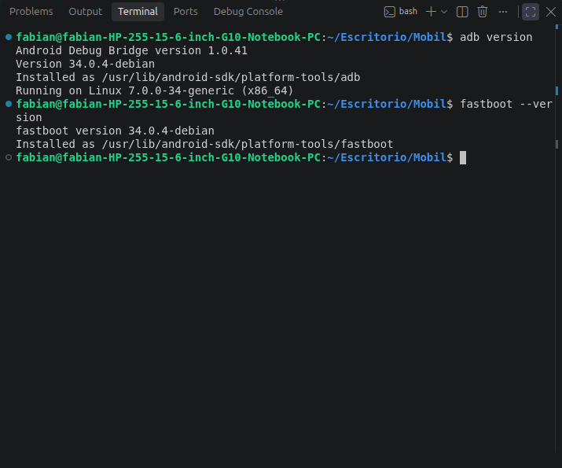

**04 — Inicio de la instalación (hallazgo #6 y #7)**
`apt install` con los paquetes indicados, paquetes ya instalados y la lista de paquetes antiguos "ya no necesarios".
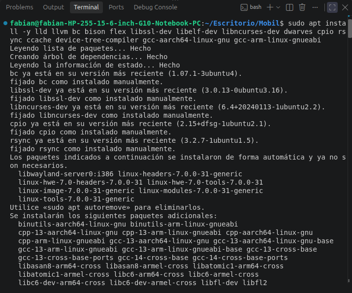

**05 — Fin de la instalación**
Configuración de `ccache`, `dwarves`, `gcc-aarch64-linux-gnu` y `gcc-arm-linux-gnueabi` sin errores.
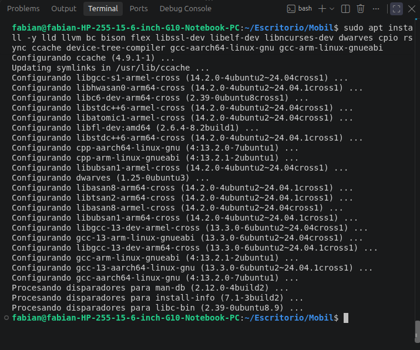

**06 — Verificación de las herramientas nuevas**
`ld.lld` 18.1.3, `llvm-ar` 18.1.3, GCC cruzado ARM64 y ARM32 13.3.0, y `dtc` 1.7.0.
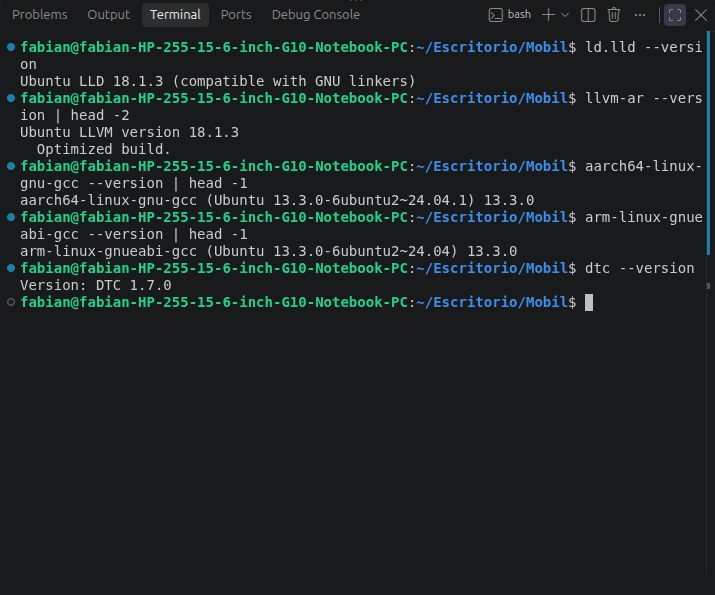

**07 — Acceso USB y estado de `mkbootimg` (hallazgos #10 y #8)**
`which` sin resultados, `mkbootimg` disponible como candidato en `apt`, `plugdev` en los grupos del usuario y `51-android.rules` presente.
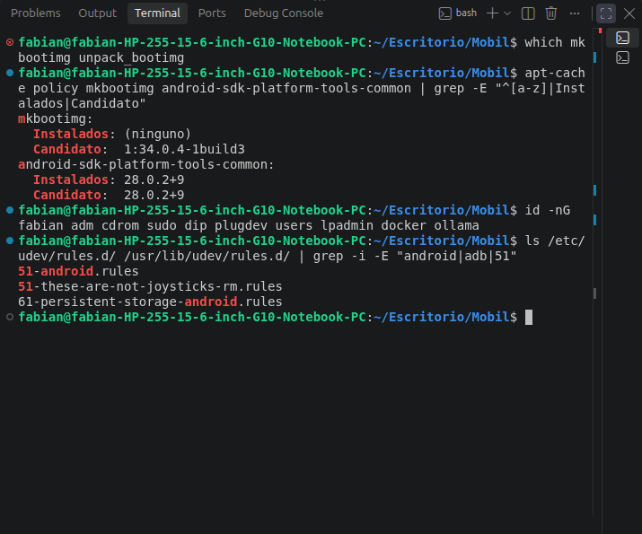

**08 — El `mkbootimg` de Ubuntu falla (hallazgo #8)**
Tras instalar, `dpkg -L` lista solo los dos scripts y `mkbootimg --help` termina con `ModuleNotFoundError: No module named 'gki'`.
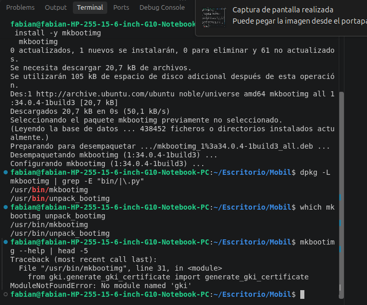

**09 — Clonado de AOSP fijado a la etiqueta (hallazgo #9)**
`git clone --depth=1 --branch platform-tools-34.0.4`, con el aviso normal de `detached HEAD`.
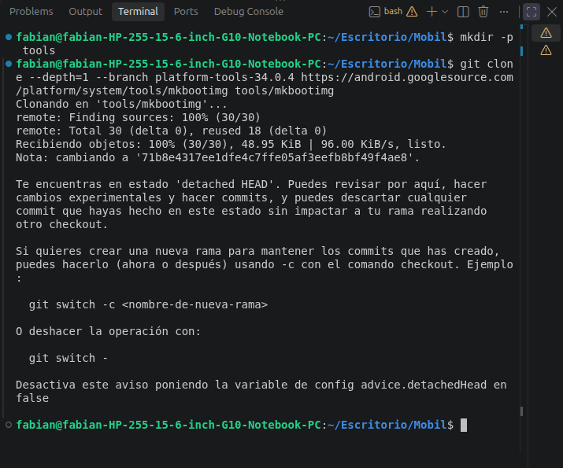

**10 — `mkbootimg` de AOSP funcionando (hallazgo #9)**
`ls` muestra la carpeta `gki` y ambos `--help` imprimen su uso sin errores.
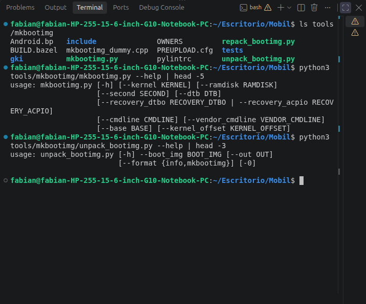

**11 — Registro de versiones guardado (hallazgo #11)**
Salida de las 16 líneas de `logs/01-versiones.txt`; la línea de LLVM muestra todavía `Optimized build.`.
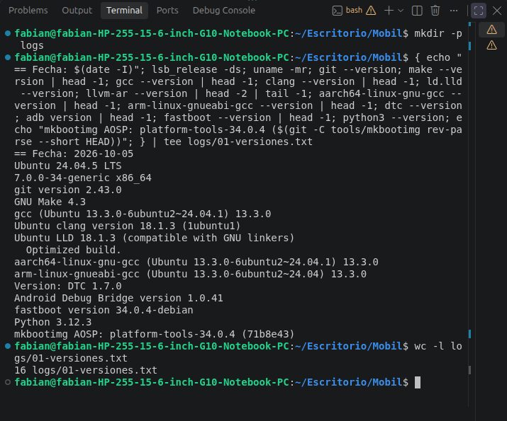

**12 — Corrección de la línea de LLVM (hallazgo #11)**
Tras el `sed -i`, la línea 9 es `Ubuntu LLVM version 18.1.3`.
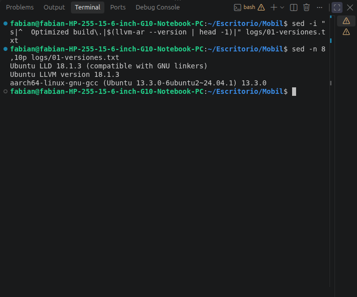

## Pendientes

- [x] Instalar `lld`, LLVM, GCC cruzados, `dtc` y dependencias de compilación.
- [x] `mkbootimg` / `unpack_bootimg` funcionando (AOSP `platform-tools-34.0.4`).
- [x] Regla `udev` y grupo `plugdev` verificados.
- [x] Guardar versiones en `logs/01-versiones.txt`.
- [ ] Diferido: instalar `qemu-system-arm`, `strace` y `gdb` cuando el módulo que los usa lo pida (QEMU en el Módulo 11).
- [ ] Diferido a Módulo 5: confirmar si Clang 18 sirve para el kernel 4.19 o hay que descargar un Clang de AOSP en `tools/`.
- [ ] Antes del Módulo 3: revisar el espacio en disco (87 GB libres) y valorar `apt autoremove` de los kernels antiguos.
