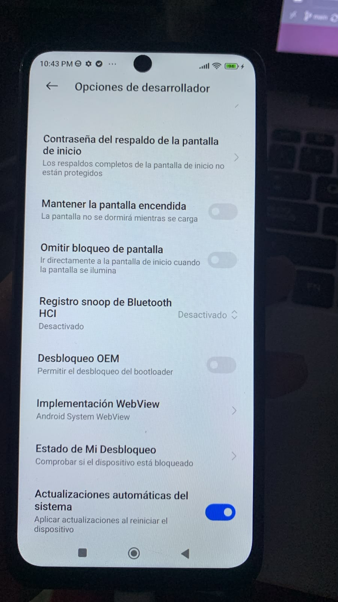
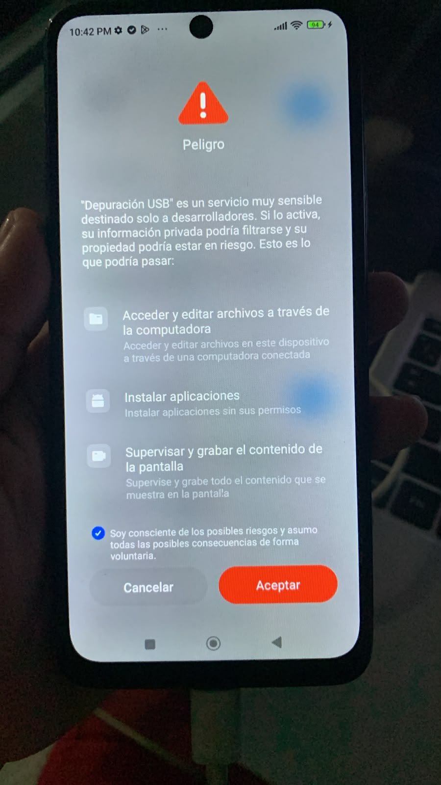
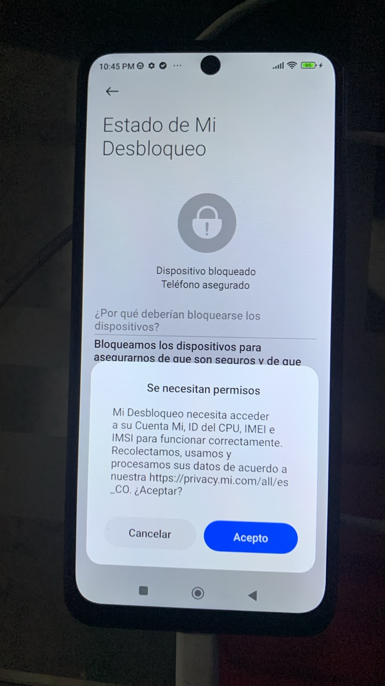
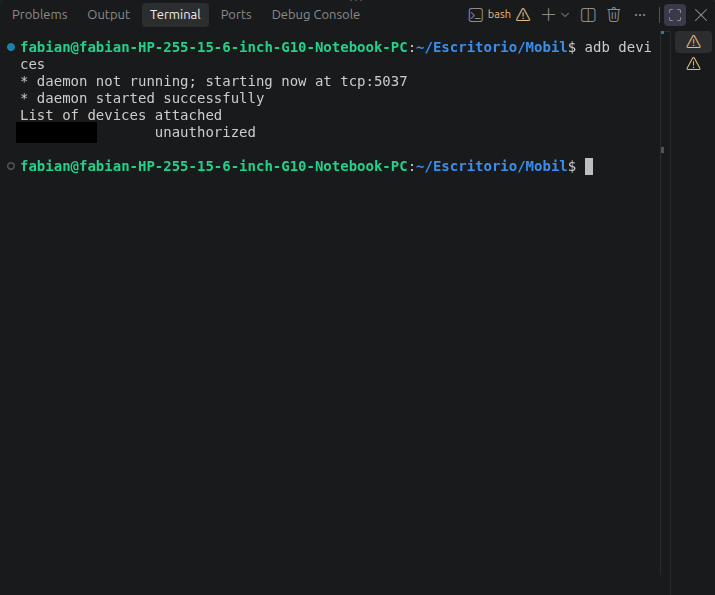
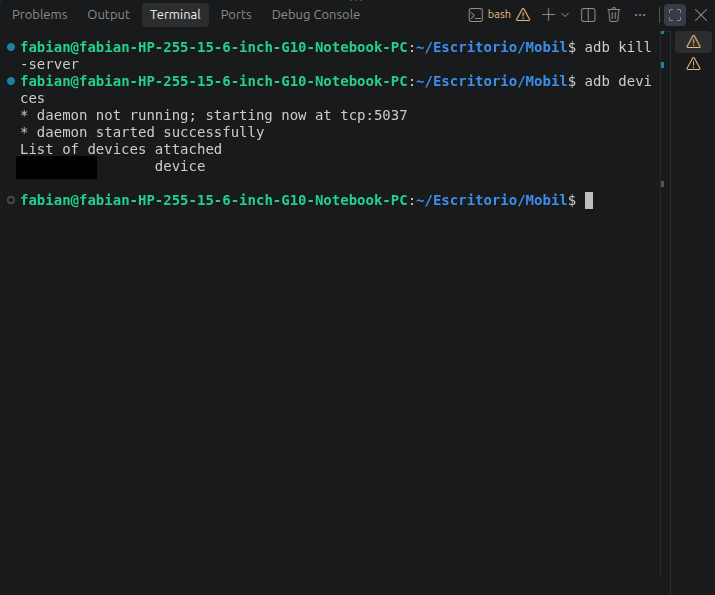
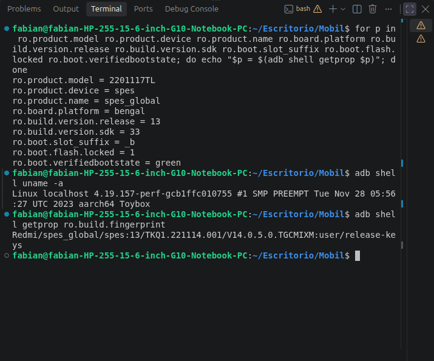
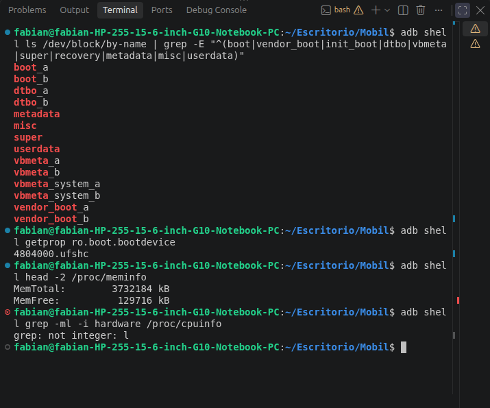
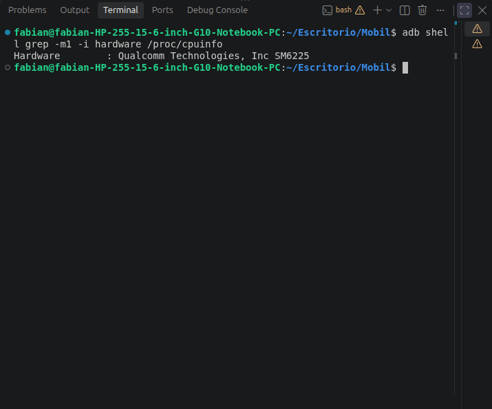

# Módulo 2 — Identificar el teléfono

- Estado: Completado
- Fecha: 2026-10-05
- Teléfono: Xiaomi Redmi Note 11 (`spes`, modelo `2201117TL`)
- Objetivo: confirmar con comandos, y no por suposición, qué teléfono es, qué Android/MIUI y kernel lleva, si es A/B y en qué estado está el bootloader. Todo en **solo lectura**: no se modificó nada del teléfono.

## Concepto

"Redmi Note 11" es el nombre comercial de varios teléfonos distintos: el 4G con Snapdragon 680 (`spes`/`spesn`) usa las fuentes de `spes-r-oss`, pero las variantes con chip MediaTek tienen otro kernel y otro árbol. Usar el árbol equivocado produce imágenes que no arrancan. Por eso este módulo es una **puerta de seguridad**: si el codename o la plataforma no coinciden, el curso se detiene aquí. En este caso coinciden.

`adb` (Android Debug Bridge) habla con Android ya arrancado y `getprop` lee las propiedades que el sistema fija al arrancar. Cada dato se contrasta contra lo esperado:

| Propiedad | Esperado | Obtenido |
|---|---|---|
| `ro.product.device` | `spes` o `spesn` | `spes` |
| `ro.board.platform` | `bengal` | `bengal` |
| `uname -a` | kernel 4.19.x, aarch64 | `4.19.157-perf`, aarch64 |
| `ro.boot.slot_suffix` | vacío o `_a`/`_b` | `_b` (A/B) |
| `ro.boot.flash.locked` | `1` = bloqueado | `1` |

## Ficha técnica del teléfono

| Dato | Valor | Cómo se obtuvo |
|---|---|---|
| Modelo | `2201117TL` (Redmi Note 11 global) | `ro.product.model` |
| Codename / nombre | `spes` / `spes_global` | `ro.product.device`, `ro.product.name` |
| SoC | Qualcomm SM6225 (Snapdragon 680), plataforma `bengal` | `ro.board.platform`, `/proc/cpuinfo` |
| Arquitectura | AArch64 | `uname -a` |
| RAM | 3 732 184 kB (≈ 3,6 GiB, modelo de 4 GB) | `/proc/meminfo` |
| Almacenamiento | UFS (`4804000.ufshc`) | `ro.boot.bootdevice` |
| Android | 13 (API 33) | `ro.build.version.release`, `.sdk` |
| ROM | MIUI 14, `V14.0.5.0.TGCMIXM` | `ro.build.fingerprint` |
| Fingerprint | `Redmi/spes_global/spes:13/TKQ1.221114.001/V14.0.5.0.TGCMIXM:user/release-keys` | `ro.build.fingerprint` |
| Kernel | `4.19.157-perf-gcb1ffc010755`, SMP PREEMPT, compilado el 28 nov 2023 | `uname -a` |
| Esquema de particiones | **A/B**, slot activo `_b` | `ro.boot.slot_suffix`, `/dev/block/by-name` |
| Particiones de arranque | `boot`, `vendor_boot`, `dtbo`, `vbmeta`, `vbmeta_system` (a/b), `super`, `misc`, `metadata`, `userdata`. Sin `init_boot` ni `recovery` | `/dev/block/by-name` |
| Bootloader | **Bloqueado** (`locked = 1`, `verifiedbootstate = green`) | `getprop` y pantalla de Mi Desbloqueo |
| Desbloqueo OEM | Apagado y atenuado | Opciones de desarrollador |

## Práctica guiada

```bash
# Paso 1-2: ver y autorizar el teléfono
adb devices                 # unauthorized
adb kill-server
adb devices                 # device (tras aceptar la huella RSA en el teléfono)

# Paso 3: identidad (solo lectura)
for p in ro.product.model ro.product.device ro.product.name ro.board.platform ro.build.version.release ro.build.version.sdk ro.boot.slot_suffix ro.boot.flash.locked ro.boot.verifiedbootstate; do echo "$p = $(adb shell getprop $p)"; done
adb shell uname -a
adb shell getprop ro.build.fingerprint

# Paso 4-5: particiones y hardware
adb shell ls /dev/block/by-name | grep -E "^(boot|vendor_boot|init_boot|dtbo|vbmeta|super|recovery|metadata|misc|userdata)"
adb shell getprop ro.boot.bootdevice
adb shell head -2 /proc/meminfo
adb shell grep -m1 -i hardware /proc/cpuinfo
```

## Hallazgos reales

1. **El teléfono aparecía `unauthorized`.** Aunque la depuración USB estaba activada, el aviso de la huella RSA no había salido. `adb kill-server` y volver a ejecutar `adb devices` con la pantalla desbloqueada hizo que apareciera, y tras aceptarlo el estado pasó a `device`.
2. **El teléfono lleva Android 13, pero el código abierto de Xiaomi es de Android 11.** Se comprobó en el repositorio oficial con `git ls-remote --heads`: la **única** rama de `spes` es `spes-r-oss` (Android R). El kernel en ejecución es de noviembre de 2023. Es el caso de "no mezclar kernel de una versión con vendor de otra": compilar `spes-r-oss` y ponerlo sobre un Android 13 puede no arrancar o dejar partes del hardware sin funcionar. Queda como riesgo principal del Módulo 7 y se probará solo con `fastboot boot` (arranque temporal).
3. **El teléfono es A/B y corre desde el slot `_b`.** La guía dejaba esta duda abierta ("por confirmar"). Todo flasheo deberá apuntar al slot correcto (`boot_a` / `boot_b`).
4. **Existe `vendor_boot`, pero no `init_boot` ni `recovery`.** El ramdisk y parte del arranque se reparten entre `boot` y `vendor_boot`; el recovery vive dentro de ellos. En el Módulo 6 hay que verificar la versión de cabecera del `boot.img` y qué contiene cada imagen.
5. **El bootloader está bloqueado, y lo confirmaron tres fuentes independientes:** `ro.boot.flash.locked = 1`, `verifiedbootstate = green` y la pantalla *Estado de Mi Desbloqueo* ("Dispositivo bloqueado, teléfono asegurado"). El interruptor *Desbloqueo OEM* está apagado y atenuado; es lo esperado antes de vincular la cuenta Mi (Módulo 3).
6. **Mi Desbloqueo pide permiso para acceder a la cuenta Mi, el ID del CPU, el IMEI y el IMSI.** Es un envío de datos a Xiaomi y no hace falta para saber si el bootloader está bloqueado (se lee por `getprop`). Se decidió **no aceptarlo en este módulo** y dejarlo para el Módulo 3, cuando se vaya a desbloquear.
7. **El sufijo `gcb1ffc010755` del kernel parece el hash de Git del commit de compilación.** En el Módulo 4 se comprobará si ese commit existe en `spes-r-oss`. **[VERIFICAR]**
8. **No se debe hacer downgrade de MIUI a Android 11 para "igualar" el kernel.** Xiaomi aplica protección *anti-rollback* en algunos modelos y flashear firmware más antiguo puede dejar el teléfono inutilizable. **[VERIFICAR]** si aplica a `spes` antes de considerarlo.
9. **Un typo cambió el resultado.** `grep -ml -i hardware` (letra L) falló con `grep: not integer: l`; con `-m1` (número uno) devolvió `Qualcomm Technologies, Inc SM6225`. En la fuente de la terminal `1` y `l` se parecen.
10. **Dos capturas mostraban el número de serie** (`adb devices`). Se taparon con un recuadro negro antes de entrar al repositorio. Al hacerlo se detectó que el serial estaba en una línea distinta en cada captura: se revisó el resultado a ojo y se corrigió una de ellas, porque el primer recuadro había quedado sobre el prompt y el serial seguía visible.
11. **La foto de WhatsApp de `img/` era un duplicado exacto** (misma imagen píxel por píxel) de la captura de Opciones de desarrollador, y se descartó.

## Evidencias

**01 — Opciones de desarrollador (hallazgos #5)**
Menú de desarrollador con *Desbloqueo OEM* apagado y atenuado y la entrada *Estado de Mi Desbloqueo*.


**02 — Aviso al activar la depuración USB**
Aviso "Peligro" de MIUI con la casilla de aceptación marcada.


**03 — Estado de Mi Desbloqueo: bloqueado (hallazgos #5 y #6)**
"Dispositivo bloqueado, teléfono asegurado", con la solicitud de permiso para cuenta Mi, ID del CPU, IMEI e IMSI sin aceptar.


**04 — `adb devices`: `unauthorized` (hallazgo #1)**
El servidor `adb` arranca y el teléfono aparece como no autorizado. Número de serie tapado.


**05 — `adb devices`: `device` (hallazgo #1)**
Tras `adb kill-server` y aceptar la huella RSA, el teléfono pasa a `device`. Número de serie tapado.


**06 — Identidad del teléfono (hallazgos #2, #3, #5, #7)**
`spes`, `bengal`, Android 13, slot `_b`, bootloader bloqueado, kernel `4.19.157-perf` y la fingerprint de la ROM.


**07 — Particiones, almacenamiento y RAM (hallazgos #3 y #4)**
`boot_a/b`, `vendor_boot_a/b`, `dtbo_a/b`, `vbmeta*`, `super`; UFS y 3,6 GiB de RAM. Un error de `grep` por el typo (hallazgo #9).


**08 — SoC confirmado (hallazgo #9)**
`Hardware : Qualcomm Technologies, Inc SM6225`.


## Pendientes

- [x] Opciones de desarrollador y depuración USB activadas.
- [x] `adb devices` en estado `device`.
- [x] Codename, plataforma, Android/MIUI y kernel confirmados.
- [x] A/B (`_b`) y bootloader bloqueado confirmados.
- [x] Ficha técnica completa.
- [x] Serial tapado en toda captura del repositorio.
- [ ] No ejecutado: contar los núcleos (`grep -c processor /proc/cpuinfo`). El SM6225 es de 8 núcleos según su ficha. **[VERIFICAR]** si hace falta.
- [ ] Opcional: foto de la pantalla *Acerca del teléfono* (sin IMEI ni serial).
- [ ] Antes del Módulo 3: comprobar si `spes` tiene protección anti-rollback antes de flashear cualquier cosa.
- [ ] Módulo 4: comparar el hash `cb1ffc010755` del kernel con la rama `spes-r-oss`.
